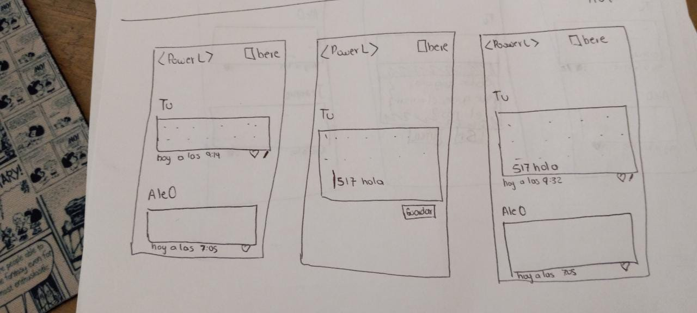
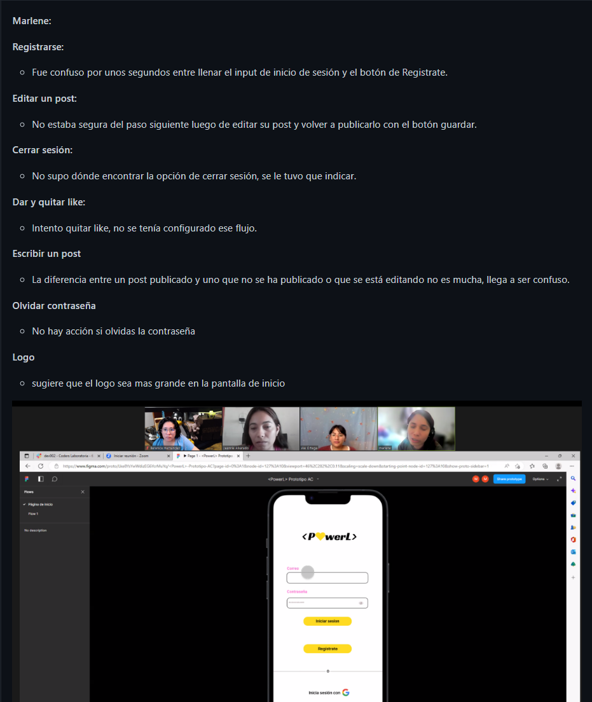

## Creada por y para Laboratorians

___
P💛werL nació desde la idea de tener una sola red que uniera a toda la comunidad de estudiantes y egresadas de cualquie bootcamp que ofrece Laboratoria.
Una red para compartir ideas, proyectos, oportunidades de empleo, tips, conocimiento, memes, etc.

## 👯‍♂️ Historias de usuaria

### 1. Registro de nueva usuaria

### 2. Inicio de sesión de usuaria registrada

### 3. Registro e inicio de sesión con Google

### 4. Publicar un post

### 5. Vista general o feed

### 6. Darle like a un post

### 7. Editar un post

### 8. Eliminar un post

## ✨ Diseño
### Prototipos de baja calidad

### Prototipo de alta calidad

## 👨🏻‍🔬 Pruebas de usabilidad

Para los testeos de usabilidad solicitamos a potenciales usuarias de nuestro producto que probaran el prototipo de alta calidad. **Connie**, **Kami**, **Marlene**, **Jess** y **Tania**, estudiantes del Bootcamp de Desarrollo Web en Laboratoria, intentaron completar las siguientes acciones en nuestro prototipo:

- Registrarse con correo
- Registrarse con google
- Iniciar sesión con correo
- Publicar un post
- Dar like a un post
- Editar post
- Eliminar post
- Cerrar sesión

Durante el test tuvimos presente a una moderadora, una observadora que tomara notas y otra que confirmara los tiempos que tomaba a cada usuaria realizar cada tarea. Al momento de testear, tomamos en cuenta:

- Naming:
 ¿Los nombres en las secciones y botones se entienden fácilmente?

- Organización:
¿La información está agrupada en categorías que hacen sentido?
¿Los elementos de la web están situados en lugares en los que el usuario busca por ellos?

- Facilidad de ubicar elementos para First time users:
¿Los elementos más comunes son fáciles de encontrar por los usuarios?
¿Las instrucciones son claras?
¿Las instrucciones son necesarias?

- Efectividad:
¿Los usuarios pueden completar las tareas?
¿Cometen errores? ¿Dónde?

Los resultados por usuaria se detallan a continuación:

## 👩🏻‍💻 Desarrollo

### Tecnologías:
* JavaScript
* NodeJs
* HTML:5
* CSS:
* Jest

### Herramientas:
* WSL
* VSC
* Firebase
* Netlify

### Boilerplate

## 🚀 Deploy

La aplicación pue desplegada en **netlify.com**

👉🏻 [<P💛werL>](https://main--effervescent-bubblegum-f1c07e.netlify.app/#/)
